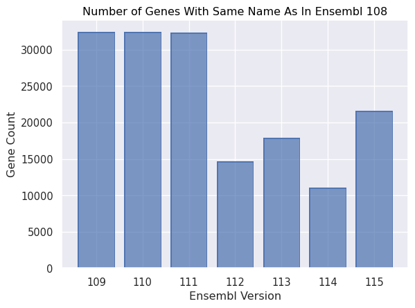
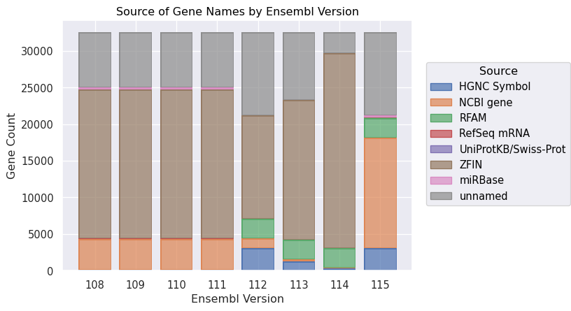
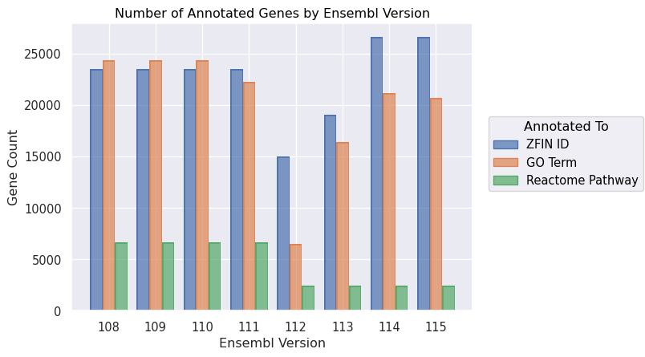
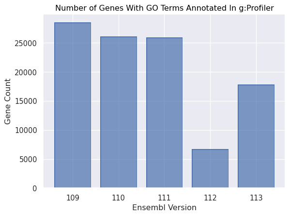

# Zebrafish Ensembl 110+ Annotation

(**Update 2025-02-04:** Added more g:Profiler data.)

(**Update 2025-05-17:** Ensembl 114 has now been released and I've updated the relevant figures below. In many ways it's an improvement, but with one large caveat. The number of genes annotated with ZFIN IDs is higher than it's ever been, and the number with GO terms is approaching previous levels, but Reactome is still languishing. Similarly, the source of gene names - well, technically, gene descriptions, which turns out to be important - is now overwhelmingly ZFIN, with human names apparently a very minor component. But there are now even fewer genes with the same name as they had in Ensembl 108. Which is curious, given the above. It turns out that there are many thousands of genes that are annotated with ZFIN IDs, have a gene description supplied by ZFIN, but that have a human gene symbol! For example, compare https://zfin.org/ZDB-GENE-030616-413 and https://www.ensembl.org/Danio_rerio/Gene/Summary?db=core;g=ENSDARG00000000563. Both have a description of "titin, tandem duplicate 1", but ZFIN correctly call the gene "ttn.1" and Ensembl call it "TTN". Similarly, https://zfin.org/ZDB-GENE-030113-2 and https://www.ensembl.org/Danio_rerio/Gene/Summary?db=core;g=ENSDARG00000028213 are both about "titin, tandem duplicate 2", but ZFIN call the gene "ttn.2", whereas Ensembl again repeat the human name "TTN". These are just two examples, but there are thousands more. Some of them are less confusing. For example, there are about seven thousand examples like https://www.ensembl.org/Danio_rerio/Gene/Summary?db=core;g=ENSDARG00000001129 ("DICER1") and https://zfin.org/ZDB-GENE-030131-3445 ("dicer1"), where they are clearly the same gene, even if I'd prefer the zebrafish lowercasing. We haven't discussed this in our lab yet, but I suspect we'll just stick with Ensembl 109 for now. But another possibility would be to use Ensembl 114 and then update the names later.)

**TL;DR:** For zebrafish, it's currently probably best to use Ensembl 109 for annotation, enrichment analysis, etc...

I was prompted to write this because someone on [Mastodon](https://genomic.social/@mmarchin/113794610067417700) mentioned that they had spotted problems with the annotation for zebrafish in Ensembl 110 and asked for advice.

When Ensembl 110 was released in 2023, I immediately noticed that there was a problem with the annotation and sent an [ensembl-dev email](https://lists.ensembl.org/pipermail/dev_ensembl.org/2023-July/009031.html) about it. It was fixed rapidly (within a week or two, from memory) by, I assume, copying over all the annotation from Ensembl 109.

Then, when Ensembl 112 was released last year, the same thing happened. I contacted the Ensembl Helpdesk, but this time the changes persisted. Here are some figures showing some of what has changed.

Probably the most noticeable issue is that gene names have changed. The figure below shows that the number of genes with the same name as in Ensembl 108 decreased massively in Ensembl 112 and 113:

This is because of changes in the source of each name, as shown by this figure:

In Ensembl 112, the number of genes whose name came from ZFIN decreased dramatically, alongside a big increase in names coming from HGNC (i.e. human gene names). The situatiion somewhat improved in Ensembl 113.

The figure below shows how the number of genes annotated to ZFIN IDs decreased markedly in Ensembl 112 before being somewhat restored in Ensembl 113. A similar pattern holds for genes annotated with Gene Ontology (GO) terms. The number of genes annotated to Reactome pathways also decreased in Ensembl 112 and only improved by a very small amount in Ensembl 113.

At this point, you might be wondering why I recommended using Ensembl 109 rather than 110. That's because there was a period when the Ensembl 110 annotation was affected too. For example, [g:Profiler](https://biit.cs.ut.ee/gprofiler]) must have downloaded Ensembl 110 data during this period. Here are the enrichment analysis results for a set of genes from one of our [recent papers](https://www.buschlab.org/publications/):

As you can see, the results differ somewhat. In this case, for Ensembl 110, the enrichment becomes less specific, which seems to be a common effect, although I've also seen cases where the enrichment instead disappears.

~~g:Profiler are due to update to Ensembl 112 (in beta at least) in the next two weeks, so I'll update with the results for that version soon.~~

g:Profiler updated to Ensembl 112 last week, so I've added the enrichment analysis for that version above. Oddly, the enrichments don't seem to correlate well with the number of genes that are annotated with GO terms in g:Profiler:

The above plot also indicates that I was perhaps wrong about g:Profiler having downloaded their data for Ensembl 110 during the period before it was updated.

As mentioned, I contacted Ensembl Helpdesk last year and they are aware of the problem and are in contact with ZFIN in order to improve things. I'm hoping to see a big improvement in Ensembl 114.

But for now, in our lab, we are using the Ensembl 109 annotation for everything. And, if using g:Profiler, we are using the [archived 109 version](https://biit.cs.ut.ee/gprofiler_archive3/e109_eg56_p17).

By the way, this repo contains all the scripts and data used to make the above figures.

If you've got any comments on the above then my email address is listed on our [lab's website](https://www.buschlab.org/team/) and I'm going to post about this on [Bluesky](https://bsky.app/profile/iansealy.com) soon.
